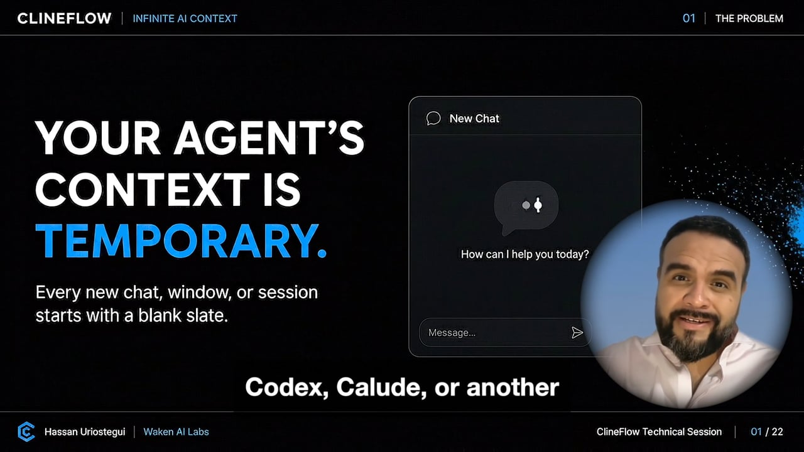

# ClineFlow

> **Infinite AI Memory across chats, agents, and teams.**

ClineFlow gives coding agents durable, Git-native project context. Decisions, goals, verification, and handoffs live beside the code in an open knowledge bundle—not inside one temporary chat or proprietary memory service.

[](https://github.com/hassanvfx/clineflow/actions/workflows/test.yml?query=branch%3Amain)
[](https://doi.org/10.5281/zenodo.22288633)
[](LICENSE)
[](https://github.com/GoogleCloudPlatform/knowledge-catalog/blob/main/okf/SPEC.md)
[](#works-with-your-agent)


## Install ClineFlow

Open your project in a coding agent and paste:

```text
Please install ClineFlow by following the instructions provided at https://github.com/hassanvfx/clineflow
```

The agent reads the current installation instructions, shows the prerequisite plan, installs ClineFlow into the project, and verifies the result.

Prefer the terminal?

```bash
# macOS and Linux
curl -fsSL https://raw.githubusercontent.com/hassanvfx/clineflow/main/template/.clineflow/bin/install | bash
```

```powershell
# Windows PowerShell
irm https://raw.githubusercontent.com/hassanvfx/clineflow/main/template/.clineflow/bin/bootstrap.ps1 | iex
```

The installer preserves existing project instructions and knowledge. When Git is available, it initializes a repository if needed—but never creates a commit, configures identity, adds a remote, or chooses a branch policy.

[Installation, lifecycle options, and troubleshooting →](docs/installation-and-lifecycle.md)

## The whole workflow is three sentences

### 1. Install once

Paste the installation prompt. ClineFlow adds a small hidden runtime, an open knowledge bundle, and shared instructions for supported coding agents.

### 2. Describe the outcome

Ask for a feature, fix, investigation, or refactor as usual. For substantial work, the agent recovers current project context and creates a tenant-scoped Engineering Journal stream. A stable opaque tenant ID comes from explicit Git author identity when available, then a local machine fallback; raw identity values never enter the repository.

### 3. Say “please commit”

```text
Please commit.
```

The agent updates the task journal, publishes an immutable additive update record, rebuilds the five local ledger views, validates the complete change set, and commits code plus context together. Concurrent tenants write separate journals and update records, so their work does not collide in shared ledger files.

The next chat begins from what the project already knows.

[See how the self-documenting loop works →](docs/how-clineflow-works.md)

## Quick tutorial

[](https://vimeo.com/1220645170?fl=pl&fe=cm)

**[Watch the 30-minute ClineFlow masterclass →](https://vimeo.com/1220645170?fl=pl&fe=cm)**

It walks through grounding a task, defining proof, building with an agent, preserving the verified state, and carrying that context into the next session.

## What gets installed

```text
your-project/
├── .clineflow/                         # Hidden, ClineFlow-managed runtime
│   ├── bin/                            # Install, update, remove, doctor, and validators
│   ├── VERSION                         # Installed release
│   ├── state                           # Release and migration state
│   ├── release-manifest                # Managed payload checksums and ownership
│   ├── PROCEDURES.md                   # Operating procedures
│   ├── WORKING_WITH_CLINE.md           # Cline guide
│   └── WORKING_WITH_CODEX.md           # Codex guide
├── knowledge/                          # Your Git-native OKF knowledge base
│   ├── index.md                        # Progressive-disclosure entry point
│   ├── updates/<topic>/                # Immutable tenant update records
│   ├── journals/<topic>/               # Tenant journal work streams
│   ├── clineflow_*.yml                 # Rebuilt local ledger views
│   └── log.md                          # Rebuilt local knowledge history
│   └── journals/                       # Detailed Engineering Journals
├── docs/
│   └── durable-development-methodology.md
├── .claude/commands/update-clineflow.md # Deterministic Claude update command
├── AGENTS.md                           # Codex, Cursor, and compatible agents
├── CLAUDE.md                           # Claude Code
├── .clinerules                         # Cline
├── .github/copilot-instructions.md     # GitHub Copilot
└── .windsurf/rules/clineflow.md        # Windsurf
```

Existing agent files are not replaced. ClineFlow adds one marker-delimited block and records whether it owns the whole file or only that block. The hidden `.clineflow/` directory is tooling; `knowledge/` is your project memory.

[Complete installed-file and ownership reference →](docs/installation-and-lifecycle.md#what-the-installer-adds)

## Journals hold the story. Ledgers make it discoverable.

An Engineering Journal is the durable record for one substantial task: its goal, decisions, work log, verification, open issues, and next steps. It replaces the fragile chat transcript with concise project knowledge.

The five YAML ledgers are the front door:

| Ledger | The question it answers |
| --- | --- |
| `clineflow_goals.yml` | Why are we doing this, and what does success mean? |
| `clineflow_specification.yml` | What behavior and constraints have we agreed on? |
| `clineflow_verification.yml` | What proves the work is complete? |
| `clineflow_last_session.yml` | What is true now, and what should happen next? |
| `clineflow_timeline.yml` | How did the project reach this state? |

Agents read the ledgers first, then follow links into relevant journals. At commit time, the journal and all five ledgers move forward together with one shared timestamp. ClineFlow validates that synchronization before the commit is created.

[Explore the OKF knowledge structure →](docs/okf-knowledge-workflow.md)

## See the project memory

Ask your agent:

```text
Please show me the ClineFlow dashboard.
```

The Knowledge Visor stays dormant until explicitly requested. On first use it shows an approval plan for its optional pinned runtime and visual assets, then generates a private, self-contained report from local OKF knowledge and Git history. The report does not edit canonical knowledge or make browser-time network requests.

Generated reports remain in `knowledge/dashboard/` even if ClineFlow tooling is later removed.

[See the Knowledge Visor's report surfaces, activation, privacy, retention, and export workflow →](docs/knowledge-visor.md)

## Update or remove it in plain English

To update:

```text
Please update ClineFlow.
```

That request authorizes the agent to consult this authoritative repository and immediately run the permanent remote updater with `--yes`. **Do not run any existing local updater first**; legacy copies can overwrite themselves. Updates are manifest-verified, preserve user-authored knowledge and instructions, and roll back automatically on failure.

### Old install or prompt not recognized?

Run this rescue command yourself from the project root. It bypasses stale installed instructions and downloads the current transactional updater directly from the authoritative repository:

```bash
curl -fsSL https://raw.githubusercontent.com/hassanvfx/clineflow/main/update.sh | bash -s -- --yes
```

On Windows PowerShell:

```powershell
& ([scriptblock]::Create((irm https://raw.githubusercontent.com/hassanvfx/clineflow/main/template/.clineflow/bin/update.ps1))) -Yes
```

After it finishes, verify the result with `cat .clineflow/VERSION` or `Get-Content .clineflow/VERSION`. If the updater cannot safely identify or migrate the installation, it stops before mutation or restores the prior installation instead of forcing an upgrade.

To remove:

```text
Please remove ClineFlow.
```

The agent first runs a dry run and explains what will be removed and preserved. It asks for confirmation before applying the removal. The managed `.clineflow/` runtime and managed instruction blocks are removed transactionally; `knowledge/`, generated dashboard reports, user documentation, and unrelated files remain.

```bash
./.clineflow/bin/uninstall --dry-run
```

[Update and removal details →](docs/installation-and-lifecycle.md#update-clineflow)

## Works with your agent

ClineFlow distributes one agent-neutral workflow through the native project-instruction files used by:

- Cline
- ChatGPT Codex
- Claude Code
- Cursor
- GitHub Copilot
- Windsurf

No Codex plugin, proprietary service, or always-running ClineFlow process is required. The durable contract is Markdown, YAML, links, and Git.

## Go deeper

- [Installation and lifecycle](docs/installation-and-lifecycle.md)
- [How ClineFlow works](docs/how-clineflow-works.md)
- [OKF knowledge workflow](docs/okf-knowledge-workflow.md)
- [Knowledge Visor](docs/knowledge-visor.md)
- [Durable development methodology](docs/durable-development-methodology.md)
- [Working with ChatGPT Codex](template/.clineflow/WORKING_WITH_CODEX.md)
- [Working with Cline](template/.clineflow/WORKING_WITH_CLINE.md)
- [Release and migration process](docs/releasing.md)
- [Changelog](CHANGELOG.md)

## Learn and contribute

- [ClineFlow website](https://www.clineflow.com/)
- [Infinite AI Context — free eBook and print edition](https://hassanvfx.github.io/infinite-ai-context/)
- [Report an issue](https://github.com/hassanvfx/clineflow/issues)
- [Contribute](https://github.com/hassanvfx/clineflow/pulls)

## License

[MIT](LICENSE)
