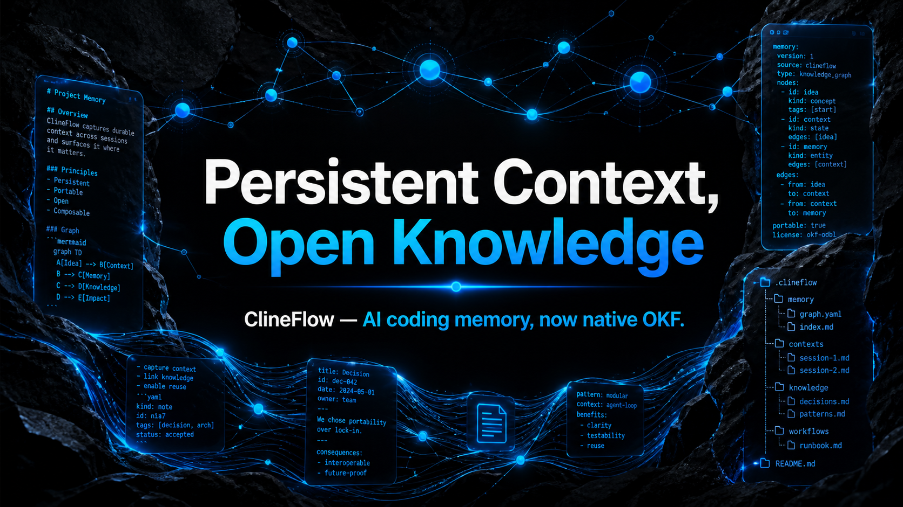
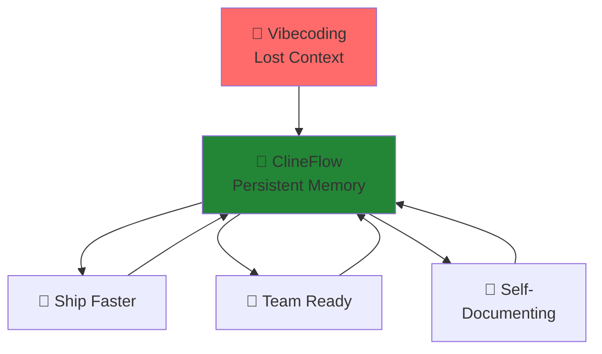
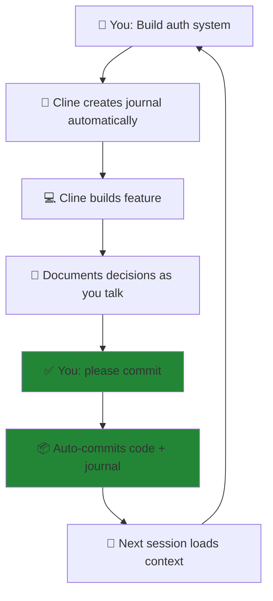
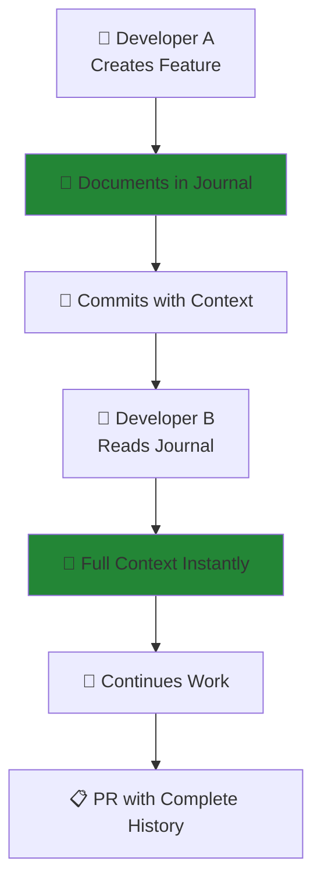
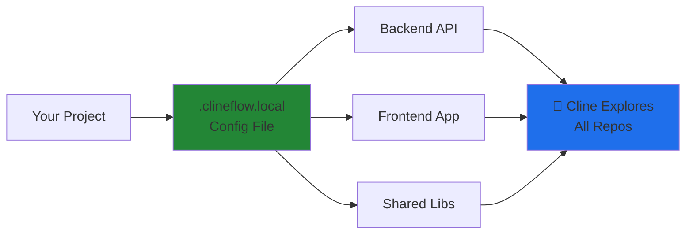
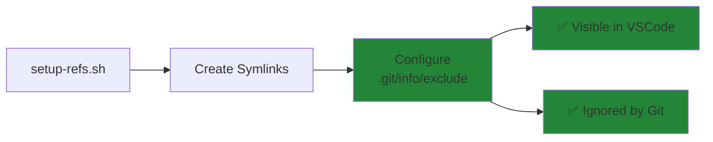
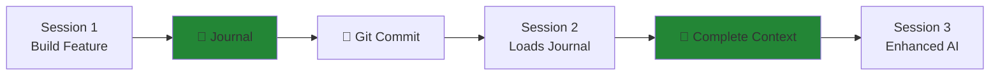
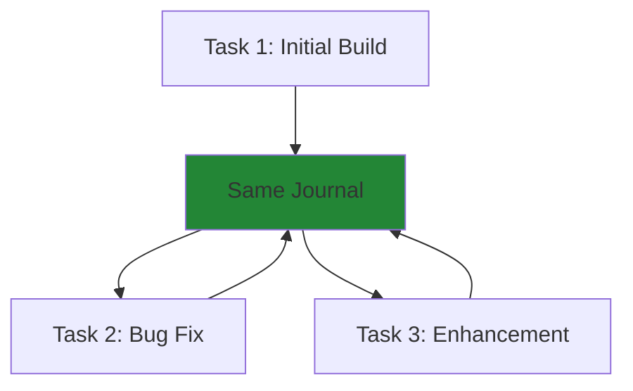

```
  ██████╗██╗     ██╗███╗   ██╗███████╗███████╗██╗      ██████╗ ██╗    ██╗
 ██╔════╝██║     ██║████╗  ██║██╔════╝██╔════╝██║     ██╔═══██╗██║    ██║
 ██║     ██║     ██║██╔██╗ ██║█████╗  █████╗  ██║     ██║   ██║██║ █╗ ██║
 ██║     ██║     ██║██║╚██╗██║██╔══╝  ██╔══╝  ██║     ██║   ██║██║███╗██║
 ╚██████╗███████╗██║██║ ╚████║███████╗██║     ███████╗╚██████╔╝╚███╔███╔╝
  ╚═════╝╚══════╝╚═╝╚═╝  ╚═══╝╚══════╝╚═╝     ╚══════╝ ╚═════╝  ╚══╝╚══╝ 
```

> **Persistent Context, Open Knowledge**
>
> **ClineFlow — AI coding memory, now native OKF.**

🤖 **Works with any AI assistant** • Cline • Cursor • GitHub Copilot • Windsurf  
✅ **Fully tested with Cline** by core development team

[](https://github.com/hassanvfx/clineflow/actions)
[](https://opensource.org/licenses/MIT)
[](https://github.com/hassanvfx/clineflow)

---



## The memory layer for AI coding agents

ClineFlow turns engineering context into portable, version-controlled knowledge. It adopts the [Open Knowledge Format introduced by Google Cloud](https://cloud.google.com/blog/products/data-analytics/how-the-open-knowledge-format-can-improve-data-sharing) and targets the [OKF v0.2 specification](https://github.com/GoogleCloudPlatform/knowledge-catalog/blob/main/okf/SPEC.md), so people and agents share the same Markdown and YAML knowledge graph—without a platform, service, or lock-in.

## Why Open Knowledge Format?

The [Google Cloud introduction to OKF](https://cloud.google.com/blog/products/data-analytics/how-the-open-knowledge-format-can-improve-data-sharing) describes a deliberately small, open contract for AI-ready knowledge: Markdown files for the human-readable narrative, YAML frontmatter for queryable metadata, normal links for relationships, and optional indexes and logs for progressive discovery and history. It is a format—not a service or SDK—so the same knowledge can move between people, coding agents, repositories, and tools.

That matters because reliable AI coding depends on context that survives the chat that created it. ClineFlow had already been built around many of the practices OKF formalizes: keeping task history beside the code, capturing decisions and verification, making context discoverable before work begins, and staying independent of any one agent or vendor. The native `knowledge/` bundle makes those conventions interoperable: every new task becomes a typed Engineering Journal concept, connected through standard Markdown, versioned with the project, and usable by any conforming producer or consumer.

- **Persistent context:** task history, decisions, tests, and next steps survive every session.
- **Open knowledge:** `knowledge/` is a readable, Git-native OKF bundle with indexes, links, and change history.
- **Agent-agnostic workflow:** Cline, Cursor, Copilot, Windsurf, and future tools receive the same instructions.
- **No added runtime:** the default validator is Bash-only; full YAML parsing is available through optional strict mode.

Existing `docs/journals/` directories remain supported as read-only legacy context. New work is always written to `knowledge/journals/`.

Read the [OKF knowledge workflow guide](docs/okf-knowledge-workflow.md) for the architecture, validation model, and upgrade behavior.

---



---

> 💡 **New to AI Coding Assistants?**
> 
> AI coding assistants like Cline, Cursor, and GitHub Copilot write code, edit files, and execute commands through natural conversation.
> 
> **Popular Options:**
> - **[Cline](https://marketplace.visualstudio.com/items?itemName=saoudrizwan.claude-dev)** - VS Code extension (our primary platform)
> - **[Cursor](https://cursor.com)** - AI-first IDE
> - **[GitHub Copilot](https://github.com/features/copilot)** - GitHub's AI assistant
> - **[Windsurf](https://windsurf.com)** - Codeium's agentic IDE
> 
> **ClineFlow gives them all persistent memory** - so they remember your entire project history across sessions.

---

## 🎯 Easy as 1-2-3

New task journals live at `knowledge/journals/<task>.md`, use YAML frontmatter, and are validated with:

```bash
./validate-okf
```

The bundled validator uses Bash only; no additional runtime or package installation is required.

For full YAML parsing in environments that already use Python, strict validation is optional:

```bash
python3 -m pip install PyYAML
./validate-okf --strict
```

**Turn Cline into a teammate who remembers everything**

### 1️⃣ Install ClineFlow

**Option 1: From VS Code (in your AI assistant)**

Using Cline, Cursor, GitHub Copilot, Windsurf, or any AI coding assistant - just start a new task and type:

```
Please install and setup clineflow here, from: https://github.com/hassanvfx/clineflow
```

**Option 2: From Terminal**

```bash
curl -fsSL https://raw.githubusercontent.com/hassanvfx/clineflow/main/install.sh | bash
```

### 2️⃣ Ask your AI assistant "How can we work?"
Your AI assistant reads your project's workflow and becomes context-aware. Through journals, every conversation builds on the last - **it remembers what you built, why you built it, and what's next.**

### 3️⃣ Say "please commit"
Your AI assistant automatically:
- 📝 Documents your decisions in the active journal
- 💾 Commits code + updated journal together
- 🔄 Creates context for your next session

**Result:** Every new task starts with full context. No more "what did we do last time?" 🎉

---

## 🌍 Agent-Agnostic Architecture

**ClineFlow automatically configures itself for multiple AI assistants.** During installation, it creates configuration files for:

- ✅ **Cline** (`.clinerules`) - *Fully tested by core team*
- ✅ **Cursor** (`AGENTS.md`)
- ✅ **GitHub Copilot** (`.github/copilot-instructions.md`)
- ✅ **Windsurf** (`.windsurf/rules/`)
- ✅ **Future agents** - Ready for any tool that emerges

**Why multiple config files?** Different AI assistants use different configuration formats. ClineFlow generates all of them from a single template, so it "just works" regardless of which tool you use.

**Current Status:** Core team actively develops and tests with Cline. Community members are welcome to test and contribute support for other agents!

> 💡 **Using a different agent?** The installation works the same - ClineFlow will create the appropriate config files automatically.

---

## 🔍 How ClineFlow Compares

Choosing the right tool for AI-assisted development? Here's how ClineFlow stacks up against other popular solutions:

### Comparison Table

| Aspect | **ClineFlow** | Kiro | spec-kit |
|--------|---------------|------|----------|
| **Type** | Memory & Documentation Layer | Standalone AI IDE | Agent-Agnostic Framework |
| **Primary Focus** | Persistent context via journals | Spec-driven development | Methodology + Commands |
| **Installation** | One-line bash script | Full IDE install | Python CLI + Git |
| **Agent Support** | Works with any (Cline, Cursor, Copilot, Windsurf) | Kiro-only | Multiple agents (Cline, Claude Code, Copilot, Cursor, etc.) |
| **Learning Curve** | Minimal - natural conversations | Medium - structured workflow | Medium - multiple phases |
| **Ceremony Level** | Low (automatic journaling) | High (formal specs required) | Medium (guided steps) |
| **Best For** | Memory persistence, ongoing projects | Greenfield projects, formal specs | Structured development, enterprise |
| **Setup Time** | < 1 minute | Full IDE switch | Several minutes |
| **Dependencies** | bash + git only | Standalone IDE | Python 3.11+, uv, git |

### When to Choose ClineFlow

✅ **Choose ClineFlow if you:**
- Want memory without changing workflow
- Already have a preferred AI assistant (Cline, Cursor, etc.)
- Value documentation that emerges naturally from work
- Need cross-repo code exploration (symlinks)
- Want minimal setup (1 bash script)
- Prefer iterative, conversation-driven development
- Working solo or small team

### When to Choose Alternatives

**Choose Kiro if you:**
- Want a purpose-built AI IDE
- Need autonomous agents with background hooks
- Building greenfield projects from scratch
- Want guided spec-driven workflow with formal specs
- Need multimodal input (images, diagrams)
- Willing to switch entire IDE
- Working on complex enterprise projects

**Choose spec-kit if you:**
- Want spec-driven without IDE lock-in
- Using multiple AI tools across team
- Need agent-agnostic workflow with formal methodology
- Working across different AI platforms
- Need formal spec documents for compliance
- Contributing to open source standard

### ClineFlow's Unique Value

**The Memory Layer That Works Everywhere:**
- Works alongside existing tools (not replacing them)
- Zero commitment (one bash script to try)
- Natural documentation (journals emerge from work)
- Cross-repo exploration (symlink system)
- Intelligent commits (automatic context preservation)

**Core Differentiator:** ClineFlow is the ONLY tool focused purely on giving AI assistants persistent memory through journals, working with any agent, with zero ceremony.

---

## 💡 Why This Changes Everything

**Without ClineFlow:**
- ❌ Each Cline session starts from scratch
- ❌ You repeat context manually every time
- ❌ No history of why decisions were made
- ❌ Can't resume work seamlessly

**With ClineFlow:**
- ✅ **Persistent Memory**: Journals capture every decision, every conversation
- ✅ **Seamless Continuation**: New tasks load previous context automatically
- ✅ **True Collaboration**: Cline becomes a partner who remembers your project
- ✅ **Zero Context Loss**: Work today, continue tomorrow without explanation

**This isn't just documentation - it's turning Cline into a teammate with memory.**

---

## 🔄 Returns Accepted Anytime

Changed your mind? No hard feelings!

```bash
./uninstall.sh
```

Your `knowledge/` bundle and legacy `docs/journals/` are safe and require manual removal if desired. [See all options →](#installation-options)

---

## 🚀 Document Driven Development (DDD)

> **From vibecoding to professional software engineering** - ClineFlow transforms informal AI chats into expert-supervised, fully documented development.

### The Natural Workflow



**1. Just Ask Cline**
```
"Build a user authentication system"
```
Cline reads `.clinerules`, understands your project standards, and gets to work. **No manual setup needed.**

**2. Cline Works Like a Senior Developer**
- 📋 **Automatically creates and updates journal** for the task
- 💬 **Documents every decision** as you discuss
- 🏗️ **Follows code organization rules** (300-500 LOC modules)
- 🧠 **Maintains context** throughout the conversation
- ✅ **Asks clarifying questions** when needed

**3. Say "please commit"**
Cline automatically:
- Updates journal with session summary
- Stages code + journal together
- Creates descriptive commit message
- Commits everything

**Result:** Professional development workflow with complete documentation - automatically.

---

### From Vibecoding to Document Driven Development

| Vibecoding (Before) | Document Driven Development (After) |
|---------------------|-------------------------------------|
| 💭 Informal chats | 📋 Structured journals |
| 🤷 Lost context between sessions | 🧠 Persistent memory across weeks |
| ❓ "What did we do last time?" | 📖 Complete decision history |
| 🎲 Hope for consistency | ✅ Expert-supervised process |
| 👤 Solo knowledge | 👥 Team-ready documentation |

### Why Document Driven Development Matters

**🎯 Professional Standards**
- Not just coding - engineering with documentation
- Every decision recorded and justified
- Code and context together in every commit

**👥 Team-Ready From Day One**
- New developers read journals to understand the "why"
- Onboarding becomes reading, not guessing
- Institutional knowledge preserved

**🔍 Expert-Supervised AI**
- AI follows your documented rules and standards
- Maintains code quality guidelines automatically
- Consistent patterns across the entire project

**📊 Complete Audit Trail**
- Every decision, every conversation, fully documented
- Understand why code exists, not just what it does
- Debug with context, not archaeology

**This isn't just AI pair programming - it's professional software engineering with AI assistance.**

---

## 🎬 See Real ClineFlow in Action

### We Built ClineFlow WITH ClineFlow

This project uses its own workflow system. See how it works in practice:

**📖 [View Our Development Journal →](docs/journals/clineflow-development.md)**

#### What You'll See:
- 🔄 **Rebranding Process** - Complete documentation of renaming llm-refs to ClineFlow
- 🧪 **Testing & Validation** - How we tested installation from GitHub  
- 📝 **Feature Development** - Built-in reference system implementation
- 🛡️ **Uninstall Safety** - Comprehensive uninstall with journal protection
- 📊 **DDD Evolution** - How we restructured README for Document Driven Development
- 🤝 **Multi-Task Pattern** - 6 tasks documented in one journal with complete context

**Result:** Professional development with complete documentation - exactly what your projects will look like.

### What Your Journals Will Look Like

Your first task with ClineFlow will create a journal like ours:
- ✅ Implementation status tracking
- 📋 Detailed entries with timestamps
- 💭 Technical decisions explained
- 🎯 Success criteria defined
- 🐛 Issues tracked
- 📚 Quick reference for future work

**This is what professional AI-assisted development looks like.**

---

## 🌍 Works For Everyone

ClineFlow scales from solo hackers to enterprise teams - same simplicity, same power.

### Solo Vibecoder


**Your workflow:**
- Idea → Build → Commit
- Zero overhead
- Automatic memory
- Just creation

### Enterprise Team



**Team workflow:**
- Onboarding = reading journals
- Complete decision history
- No tribal knowledge
- Audit-ready documentation

**Same tool. Any scale.**

---

## 🔗 Cross-Team Code Access

> **Simple alternative to MCP fileserver** - Give Cline instant access to your entire organization's codebase

### The Problem

Your team works across multiple repositories. Cline needs context from:
- Backend APIs
- Frontend applications  
- Shared libraries
- Documentation repos
- Legacy systems

**Traditional solution:** Complex MCP fileserver setup with running processes and network overhead.

**ClineFlow solution:** 3-line config file. Done.

### MCP Fileserver vs ClineFlow References

| MCP Fileserver | ClineFlow References |
|----------------|---------------------|
| ❌ Complex server configuration | ✅ Simple config file |
| ❌ Requires running process | ✅ Native filesystem symlinks |
| ❌ Per-developer setup | ✅ Team shares one config |
| ❌ Network latency | ✅ Instant local access |
| ❌ Additional dependencies | ✅ Zero dependencies |

### How It Works



**Result:** Cline can explore and reference any linked repository as if it's part of your current project.

### 30-Second Setup

1. **Edit one config file:**
   ```bash
   cp .clineflow.example .clineflow.local
   nano .clineflow.local
   ```

2. **Add your repo paths:**
   ```bash
   BACKEND_API_PATH="/path/to/backend-api"
   FRONTEND_APP_PATH="/path/to/frontend-app"
   SHARED_LIBS_PATH="/path/to/shared-libraries"
   ```

3. **Run setup:**
   ```bash
   ./setup-refs.sh
   ```

**That's it.** Cline now has access to all repos.

### Cross-Team Use Cases

**Full-Stack Development:**
```
You: "How does the frontend call the user authentication API?"
Cline: Reads backend API, frontend code, shows complete flow
```

**Microservices:**
```
You: "Which services depend on the payment service?"
Cline: Scans all linked repos, finds dependencies
```

**Onboarding:**
```
New Dev: "Explain the architecture"
Cline: Navigates across all repos, provides complete overview
```

**Refactoring:**
```
You: "I'm changing this shared library function"
Cline: Finds all usages across every linked repository
```

### Team Benefits

✅ **Share config in git** - Everyone gets same setup  
✅ **No server maintenance** - Just filesystem symlinks  
✅ **Instant updates** - Changes sync automatically  
✅ **Zero overhead** - Native file access  
✅ **Works offline** - No network required

### Git Safety Built-In

**The reference system automatically handles git exclusion:**



**Why this matters:**
- Symlinks contain absolute paths specific to each developer
- Committing them would break for other developers
- `.git/info/exclude` keeps them local-only but visible
- No `.gitignore` complexity needed

**Example:**
```
Developer A: clineflow/backend-api → /Users/alice/repos/backend-api
Developer B: clineflow/backend-api → /home/bob/projects/backend-api
```
Both work perfectly. No conflicts. Ever.

### Advanced Configuration

**Full details:** See [clineflow/README.md](template/clineflow/README.md) for advanced features:
- Automatic symlink management
- Git exclusion handling
- Clean mode for fresh starts
- Integration with build tools

---

## 🎁 What You Get

### 🚀 Intelligent Commits
Just say "please commit" and watch Cline:


Traditional workflow requires 5+ manual steps. ClineFlow: **One phrase.**

### 📝 Persistent Context


**Never repeat yourself again.** Each session builds on the last.

### 🏗️ Professional Code Organization

Built-in guidelines ensure maintainable code:

- **Module/File Size**: 300-500 LOC ideal, >1K LOC unacceptable
- **Single Responsibility**: Each file has one clear purpose
- **Composition Over Monoliths**: Break large files into focused units

**Universal:** Works for any language - Python classes, JavaScript components, Go packages, Rust modules, etc.

### 🔄 Multi-Task Journals



Keep related work in one place. Complete context for entire feature lifecycle.

### 🎯 Zero Dependencies

Just bash + git. Works everywhere:
- ✅ Python projects
- ✅ JavaScript/TypeScript
- ✅ Go, Rust, Java, C++
- ✅ Any language with git

---

## 🎬 Quick Start

### One-Line Install

**Method 1: Just Ask Your AI Assistant (Easiest)**

Using Cline, Cursor, GitHub Copilot, Windsurf, or any AI coding assistant - just start a new task and say:

```
Please install and setup clineflow here, from: https://github.com/hassanvfx/clineflow
```

Your AI assistant will read the repository, understand the installation process, and set everything up for you.

**Method 2: Direct Installation (Traditional)**

```bash
# Using curl
curl -fsSL https://raw.githubusercontent.com/hassanvfx/clineflow/main/install.sh | bash

# Using wget
wget -qO- https://raw.githubusercontent.com/hassanvfx/clineflow/main/install.sh | bash
```

### What Gets Installed

```
your-project/
├── .clinerules                    # Cline
├── AGENTS.md                      # Cursor, Copilot, universal
├── .github/
│   └── copilot-instructions.md    # GitHub Copilot
├── .windsurf/
│   └── rules/
│       └── clineflow.md           # Windsurf
├── clineflow/                     # Reference documentation
│   ├── JOURNAL_TEMPLATE.md        # Legacy-journal compatibility notice
│   ├── PROCEDURES.md              # Standard operating procedures
│   ├── WORKING_WITH_CLINE.md      # Complete user guide
│   └── README.md                  # ClineFlow overview
├── knowledge/                     # Native OKF v0.2 knowledge bundle
│   ├── index.md                   # Bundle navigation and version declaration
│   ├── log.md                     # Dated knowledge history
│   └── journals/                  # Engineering Journal concepts
│       ├── index.md
│       └── TASK_TEMPLATE.md
├── validate-okf                   # Dependency-free OKF structural validator
├── setup-refs.sh                  # Reference system setup (optional)
├── .clineflow.example             # Reference system config example (optional)
├── update.sh                      # Update script (get latest features)
└── VERSION                        # Tracks your installation version
```

---

## 🔄 Updating ClineFlow

Already have ClineFlow installed? Get the latest features and improvements!

### Quick Update

```bash
# Download and run update script
curl -fsSL https://raw.githubusercontent.com/hassanvfx/clineflow/main/update.sh | bash
```

Or if you already have the script:

```bash
./update.sh
```

### What Gets Updated

✅ **Template files** - Latest procedures, documentation, and features  
✅ **Setup scripts** - Reference system improvements  
✅ **Configuration examples** - New options and best practices

### What Stays Protected

🔒 **Your customizations** - `.clinerules` remains untouched  
🔒 **Your local config** - `.clineflow.local` preserved  
🔒 **Your work** - All knowledge in `knowledge/` and legacy journals in `docs/journals/` safe

### Preview Changes First

```bash
# See what would be updated without changing anything
./update.sh --dry-run
```

### Check Version

```bash
# Your current version
cat VERSION

# Latest available version
curl -fsSL https://raw.githubusercontent.com/hassanvfx/clineflow/main/VERSION
```

### Update Options

```bash
./update.sh --help      # Show all options
./update.sh --dry-run   # Preview updates
./update.sh --yes       # Skip confirmation
```

**📋 Full update history:** See [CHANGELOG.md](CHANGELOG.md) for complete release notes.

---

## 🎯 Quick Wins

Real scenarios showing ClineFlow in action:

### Scenario 1: Feature Development
```
You: "Build a user dashboard"
Cline: Creates knowledge/journals/user-dashboard.md automatically
You: Work together, discuss approaches
Cline: Documents every decision in journal
You: "please commit"
Cline: Commits code + updated journal together
```
**Result:** Complete feature with documentation trail.

### Scenario 2: Bug Fix
```
You: "Fix the login timeout issue"
Cline: Updates existing knowledge/journals/auth-system.md journal
You: Discuss root cause analysis
Cline: Documents the fix and reasoning
You: "please commit"
Cline: New entry in journal, all context preserved
```
**Result:** Bug fixed with complete troubleshooting history.

### Scenario 3: Code Review
```
Developer 1: Builds feature, journals it
Developer 2: Reads journal before reviewing code
Developer 2: "I see why you chose this approach"
```
**Result:** Informed code reviews, no guessing.

### Scenario 4: Resuming Work
```
You: Return after 2 weeks
You: "What were we working on?"
Cline: Reads latest journal, provides complete summary
You: Continue exactly where you left off
```
**Result:** Zero context loss, instant resumption.

---

## 🛠️ Power User Tips

### Installation Options

```bash
# Dry run (see what would be installed)
./install.sh --dry-run

# Force overwrite existing files
./install.sh --force

# Uninstall
./install.sh --uninstall

# Show help
./install.sh --help
```

### Returns Accepted Anytime 🔄

Changed your mind? No hard feelings!

Download and run the uninstall script in your project directory:

```bash
# Using curl
curl -fsSL https://raw.githubusercontent.com/hassanvfx/clineflow/main/uninstall.sh | bash

# Using wget
wget -qO- https://raw.githubusercontent.com/hassanvfx/clineflow/main/uninstall.sh | bash

# Or if you have the repo
./uninstall.sh
```

**What gets removed:**
- `.clinerules`
- `clineflow/` directory
- `setup-refs.sh` and `.clineflow.example`
- `.clineflow.local` (if exists)
- `validate-okf`
- Reference symlinks (if configured)

**⚠️ Note:** Your `knowledge/` bundle and any legacy `docs/journals/` are safe and require manual removal if desired.

**Options:**
```bash
./uninstall.sh --dry-run    # Preview what would be removed
./uninstall.sh --yes        # Skip confirmation prompt
./uninstall.sh --help       # Show all options
```

### Customization

Edit `.clinerules` to customize for your project:
- Adjust code size limits
- Add project-specific rules
- Configure documentation patterns

### Reference System (Optional)

> 💡 **Super Easy Setup - Just Ask Cline!**
> 
> Instead of following manual steps, you can simply ask Cline:
> 
> *"In this project I need to setup cline refs to project-a and project-b which live in the parent folder (repos) to this. Can you help me?"*
> 
> Cline will read the documentation and set everything up for you automatically! ✨

**Example conversation:**
```
You: "I need to setup cline refs to my-backend-api and my-frontend-app 
      which are sibling directories in the parent repos folder."

Cline: "I'll help you set up the reference system. I can see you need:
        - my-backend-api (at ../my-backend-api)
        - my-frontend-app (at ../my-frontend-app)
        
        I'll create the config file and run the setup script."
        
[Cline creates .clineflow.local, adds paths, runs ./setup-refs.sh]

Cline: "✅ Reference system configured! You can now use:
        @clineflow/my-backend-api/path/to/file
        @clineflow/my-frontend-app/path/to/file"
```

**Link other codebases for Cline exploration** - useful when you want Cline to have context from external projects.

**What it does:**
- Creates symlinks in `clineflow/` pointing to other repositories
- Cline can explore those repos using @ mentions: `@clineflow/backend-api/README.md`
- No file duplication - changes sync instantly via symlinks

**Quick setup (3 steps):**

1. **Clone external repos** wherever you prefer:
   ```bash
   cd ~/projects
   git clone https://github.com/your-org/backend-api
   ```

2. **Configure paths** in your project:
   ```bash
   # Copy example config
   cp .clineflow.example .clineflow.local
   
   # Edit with your paths
   nano .clineflow.local
   ```
   
   Add your repository paths:
   ```bash
   BACKEND_API_PATH="/Users/yourname/projects/backend-api"
   FRONTEND_APP_PATH="/Users/yourname/projects/frontend-app"
   ```

3. **Run the setup script** (included with ClineFlow):
   ```bash
   ./setup-refs.sh
   ```

**Result:** Cline can now explore linked repos as if they were part of your project!

#### Git Safety 🔒

**Symlinks are local-only and developer-specific:**
- ✅ **Visible in VSCode** - Full file explorer access
- ✅ **Never committed** - Automatically excluded via `.git/info/exclude`
- ✅ **No conflicts** - Each developer has their own paths
- ✅ **Team-ready** - Share config, not symlinks

**How it works:**
- `setup-refs.sh` automatically configures `.git/info/exclude`
- This is like `.gitignore` but local-only (never committed)
- Symlinks stay visible but git ignores them completely
- Each developer can have different repository locations

**Safety checks:**
- ⚠️ Warns if symlinks are accidentally staged for commit
- ✅ Provides clear remediation instructions
- ✅ Works in both git and non-git projects

**Full details:** See [clineflow/README.md](template/clineflow/README.md) for advanced configuration.

#### Troubleshooting: @ Mentions Not Working?

**Problem:** When typing `@` in Cline, symlinked files don't appear in autocomplete.

**Solution:** Use the generated workspace file for full @ mention completion:

```bash
# Re-run setup to generate/update workspace file
./setup-refs.sh

# Open project with workspace file (enables @ completion)
code my-project.code-workspace
```

**Why this works:**
- Symlinks alone provide filesystem access but not VS Code indexing
- Multi-root workspace makes all repos fully indexed by VS Code
- Cline's @ mention feature depends on VS Code's file index
- Workspace file = complete autocomplete for all linked repositories

**What you get with workspace file:**
- ✅ Full @ mention autocomplete in Cline chat
- ✅ Search works across all repositories
- ✅ IntelliSense recognizes linked code
- ✅ Keeps symlinks for backward compatibility

**Idempotent upgrade:** Safe to re-run `./setup-refs.sh` anytime - it updates the workspace file without breaking existing setups.

---

## 📚 Documentation

- **[WORKING_WITH_CLINE.md](template/clineflow/WORKING_WITH_CLINE.md)** - Complete user guide
- **[PROCEDURES.md](template/clineflow/PROCEDURES.md)** - Standard operating procedures
- **[TASK_TEMPLATE.md](template/knowledge/journals/TASK_TEMPLATE.md)** - Native OKF journal template
- **[OKF Knowledge Workflow](docs/okf-knowledge-workflow.md)** - Bundle architecture, validation, and legacy compatibility
- **[clineflow/README.md](template/clineflow/README.md)** - Reference system overview

---

## 🚀 Be an Early Adopter

⭐ **[Star us on GitHub](https://github.com/hassanvfx/clineflow)** - Help others discover ClineFlow

🐛 **[Report Issues](https://github.com/hassanvfx/clineflow/issues)** - Found a bug? Let us know

💡 **[Request Features](https://github.com/hassanvfx/clineflow/issues)** - Have an idea? We're listening

🤝 **[Contribute](https://github.com/hassanvfx/clineflow/pulls)** - Help build the future of AI-assisted development

**Help us build the future of AI-assisted development** - where AI doesn't just write code, it becomes your teammate with memory.

---

## 🤝 Contributing

Contributions welcome! Please:

1. Fork the repository
2. Create a feature branch
3. Make your changes
4. Create an Engineering Journal concept documenting your work
5. Submit a pull request

**We use ClineFlow to build ClineFlow** - your contribution will be a real-world example!

---

## 🐛 Issues & Support

- **Issues**: [GitHub Issues](https://github.com/hassanvfx/clineflow/issues)
- **Discussions**: [GitHub Discussions](https://github.com/hassanvfx/clineflow/discussions)

---

## 🚀 What's Next?

After installation:

1. **Ask Cline**: "How can we work together?"
2. **Start Building**: Tell Cline what you want
3. **Commit Intelligently**: Just say "please commit"
4. **Read Our Journal**: See ClineFlow in action: [docs/journals/clineflow-development.md](docs/journals/clineflow-development.md)

**Welcome to Document Driven Development! 🎉**

---

## 📝 License

MIT License - see [LICENSE](LICENSE) for details

---

## 🙏 Acknowledgments

Created to solve the challenge of maintaining context and documentation when working with AI assistants.

**Because AI assistants with memory become teammates.**

---

Made with ❤️ for developers working with AI assistants
